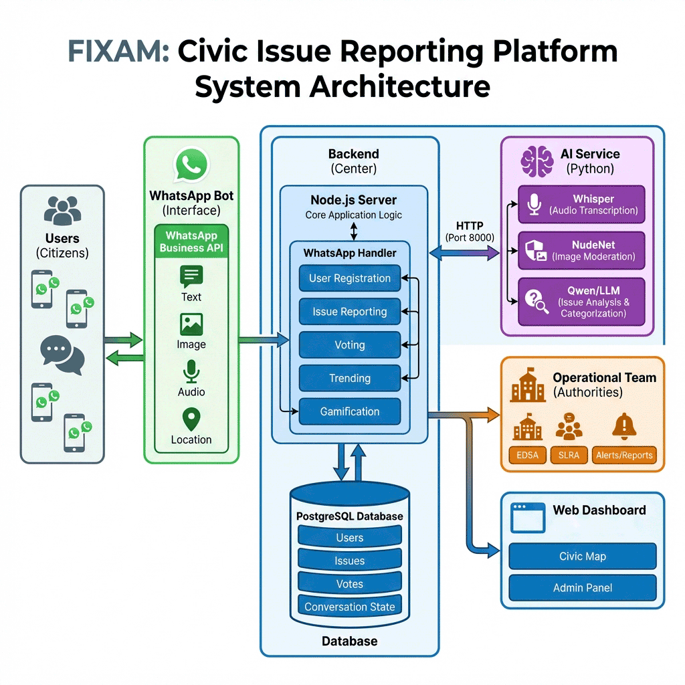

# FIXAM - Facilitating Issue eXchange for Accountable Municipalities

[](https://opensource.org/licenses/MIT)

**Live Demo:** <a href="https://fixam.maxcit.com/" target="_blank">https://fixam.maxcit.com/</a>

A comprehensive civic engagement ecosystem that empowers citizens to report municipal issues via WhatsApp and enables authorities to manage, analyze, and resolve them efficiently through advanced AI and automation. This project is proudly designed as a **Digital Public Good (DPG)**, adhering to open-source principles to ensure accessibility, transparency, and community-driven improvement.

## Project Structure

```
Codebase/
├── frontend/              # Web interface
│   ├── admin/             # Admin Portal
│   │   ├── issues.html    # Issue Management & Timeline
│   │   ├── overview.html  # Analytics & Insights Dashboard
│   │   └── users.html     # User & Group Management
│   ├── css/
│   │   └── style.css      # Design System
│   ├── js/                # Application Logic
│   │   ├── map.js         # Interactive Civic Map
│   │   └── ...
│   ├── index.html         # Public Civic Map
│   └── dashboard.html     # Public Statistics
│
├── backend/               # Node.js API Core
│   ├── db/                # PostgreSQL Schema & Migrations
│   ├── services/
│   │   ├── aiService.js   # AI Integration (Classification, Summarization)
│   │   ├── whatsappHandler.js # Conversational Logic & State Machine
│   │   └── ...
│   ├── ai_service/        # Local Python AI Microservices
│   │   ├── main.py        # FastAPI Entrypoint
│   │   └── ...            # Parakeet ASR, NudeNet, Embeddings
│   └── ...
│
├── simulator/             # WhatsApp Simulator (testing, no Meta account needed)
│   ├── public/            # Browser chat UI
│   ├── mockWhatsApp.js    # Stand-in for the WhatsApp transport
│   └── server.js          # Drives the real handler in-process
│
└── docker-compose.yml     # Full stack: db, api, ai engine, web, simulator
```


## System Architecture



## Key Features

### 1. 🤖 Intelligent WhatsApp Bot
The primary reporting channel, designed for accessibility and ease of use.
- **Conversational Reporting**: Guided flow for citizens to report issues naturally.
- **AI-Powered Analysis**: instant categorization, summarization, and urgency detection using Embeddings & TextRank.
- **Voice-to-Text**: Native support for **Voice Notes** (Krio/English), transcribed locally via NVIDIA Parakeet.
- **Media Support**: Users can send photos or videos as evidence.
- **Safety First**: Automated content moderation filters unsafe images (e.g., nudity) using local NudeNet.
- **Child Safeguarding**: Photographs showing the face of a child (0-12) are refused and never stored. Faces are located first, then age-classified individually, so a photo with no people in it — nearly everything citizens send — is never affected.
- **Location Intelligence**: GPS pins and typed addresses, reverse-geocoded into district/city/ward. Locations outside the served country are refused, and reports survive a geocoder outage by keeping the citizen's own wording for an admin to place.
- **Duplicate Detection**: Open issues within 100 m reported in the last 7 days are shown to the citizen before they submit — configurable, and never blocking: they can still file it for admin review.
- **Automated Feedback Loop**: Citizens receive real-time status updates via WhatsApp when their issue is acknowledged or resolved, keeping them informed without manual follow-ups.

### 2. 🌍 Public Civic Map & Dashboard
Transparent real-time visualization for the community.
- **Interactive Map**: Visualizes reported issues with color-coded markers (Critical, In Progress, Resolved).
- **Vote & Support**: Citizens can upvote issues to signal priority to authorities.
- **Search & Filter**: Find issues by category, ID, or status.
- **Statistics**: Public view of resolution rates and key metrics.

### 3. 🛡️ Admin Command Center
A powerful suite for government and operational teams.
- **Dashboard & Analytics**: High-level overview of reporting trends, resolution rates, and critical hotspots.
- **Issue Management**: 
  - Detailed view of every report with geolocation, evidence, and AI analysis.
  - **Activity Timeline**: Full audit trail showing *who* reported it, *when*, and every status change.
  - **Status Workflow**: Manage lifecycle (Acknowledged → In Progress → Fixed) with mandatory resolution notes.
- **Duplicate Management**: Advanced tools to link/unlink reports, aggregating votes and keeping the map clean.
- **User & Group Management**: 
  - Manage personnel (Admins, Operations, Users).
  - Create Departments/Groups (e.g., "Roads Authority", "Water Board") to organize operational teams.
- **Role-Based Access**: An MDA sees only the reports, users and categories for the
  categories its institution owns. Administrators see everything. Enforced on every
  request, not by hiding buttons.
- **Open / Closed Lifecycle**: Resolving closes a report automatically; closing without
  a repair requires a reason and a written explanation, both sent to the citizen and
  published.
- **Administrative Audit Log**: Account, role, group and category changes, sign-ins and
  refused sign-ins, and every data export — Administrator only.
- **Scoped Export**: CSV of the reports an account may see. Reporter names and phone
  numbers are opt-in, Administrator-only, and every export is recorded.
- **Two-Factor Sign-In**: Password plus a one-time code the administrator requests over
  WhatsApp.
- **Persistent Filtering**: Shareable URLs with pre-applied filters for efficient collaboration.

### 4. ⚡ Automatic Operational Alerts
Bridging the gap between report and resolution.
- **Smart Routing**: Issues are automatically forwarded to the relevant department based on category (e.g., "Electricity" → Energy Authorities/EDSA).
- **Instant Notifications**: Operational team members receive immediate WhatsApp alerts containing:
  - 🚨 Issue Title & ID
  - 📍 Precise Location/Address
  - 🔗 Direct Link to Web Portal
- **Broadcast System**: Ensures entire teams are synchronized on critical infrastructure failures.

### 5. 📝 Institution Questionnaires
Extra questions, asked by the institution that owns the report — without a deployment.
- **Reporting stays three questions**: evidence, location, description. Most reports need nothing more.
- **Follow-up on acknowledgement**: when an MDA confirms a report is theirs, the citizen is asked that institution's own questions — EDSA needs a meter number, FCC does not.
- **Asked late, on purpose**: the category is a guess until a human confirms it, so asking at reporting time would collect the wrong institution's answers.
- **Authored in the portal**: an MDA writes its own questions; MoCTI/DSTI approve before anything reaches a citizen. Versioned, with rollback and a full audit trail.
- **Nothing to skip past**: every question can be skipped and the whole thing stopped, and answers land on the report.

### 6. 🧠 Local AI Engine
Privacy-focused, offline-capable AI services running alongside the platform.
- **Text Classification**: Automatically tags issues (e.g., "Pothole" → "Road Infrastructure").
  Each category carries **example reports**, written the way citizens actually report the
  problem, which is what the classifier matches against. A category name alone is a poor
  description of a complaint — "the transformer burnt" reads as a fire until something has
  been told that a burnt transformer is an electricity problem. Editable under
  **Users & Groups → Categories**, so a misfiled phrasing is corrected without a deployment.
- **Transcription**: Voice-to-text for inclusive reporting.
- **Content Safety**: On-device image analysis to protect the platform from abuse.

### 7. 🏆 Citizen Rewards System
Gamifying civic engagement to encourage consistent participation.
- **Earn Points**: Citizens accumulate digital points for positive actions:
  - **+10 Points**: Reporting a valid issue.
  - **+50 Points**: When a reported issue is physically resolved (Verified Fix).
  - **+1 Point**: Each time a community member upvotes their report.
- **Leaderboard**: Users can track their "Citizen Score" directly via WhatsApp.
- **Incentives**: High-scoring citizens gain recognition, fostering a sense of ownership and civic pride.

## Quick Start (Docker)

Everything — database, API, AI engine, web portal and the WhatsApp simulator — comes up with one command:

```bash
docker compose --profile simulator up -d --build
```

That is the whole install. No `.env` is required to start: every value has a working default in `docker-compose.yml`. Those defaults are public, so before exposing the stack to anyone, copy the template and set your own:

```bash
cp .env.example .env
```

First run builds the images and downloads the speech model (~2.5 GB), so allow 30–60 minutes on a normal connection — the AI engine's dependency install is the slow part. Later starts take seconds. Consider [pre-downloading the model](#pre-downloading-the-speech-model) so the download is a visible, retryable step rather than a background one.

### Configuration

There is exactly one environment file: **`.env` at the repository root**. The backend, the simulator and every maintenance script read it through a shared loader, and Docker Compose passes it to all containers. `.env.example` is its documented template and the only env file in version control.

```
.env.example   committed — the template, safe to publish
.env           gitignored — your real values, never commit
```

The variables you are most likely to change:

| Variable | Why it matters |
|---|---|
| `SUPER_ADMIN_PHONE` / `SUPER_ADMIN_PASSWORD` | Creates the first admin account on boot. Change the password. |
| `DB_PASSWORD` | Defaults to a public value. |
| `FIXAM_BASE_URL` | The address citizens see in ticket links. Must match how the frontend is actually reachable. |
| `PARAKEET_MODEL` | Speech-to-text model. Changing it changes the RAM needed — see [System Requirements](#system-requirements). |
| `DEV_MODE` | `true` hides the public site behind a maintenance screen and restricts the bot to admins. |
| `SIMULATOR_ENABLED` | Lets the backend mirror admin notifications into the simulator. On by default; simulated traffic is refused when `NODE_ENV=production`. |
| `DUPLICATE_RADIUS_METERS` / `DUPLICATE_WINDOW_DAYS` | Tune duplicate detection (default 100 m / 7 days). |
| `MINOR_DETECTION_ENABLED` | Child-safeguarding image check. On by default; turning it off is a deliberate act. |

### What you get

| Service | URL | Notes |
|---|---|---|
| Public civic map | http://localhost | Hidden behind a maintenance screen when `DEV_MODE=true` |
| Public statistics | http://localhost/dashboard | Open to everyone |
| Admin portal | http://localhost/admin | Login required — see below |
| WhatsApp simulator | http://localhost:4001 | Only with `--profile simulator` |
| Backend API | http://localhost:5000/api | Also proxied at `http://localhost/api` |
| PostgreSQL | localhost:5432 | Credentials from `.env` |

The AI engine is published on `http://localhost:8000` so it can be exercised
directly with curl or Postman. The backend reaches it over the compose network
and does not need the mapping — remove it to keep the engine internal-only.

### Logging in

The super admin is created automatically on first backend boot from
`SUPER_ADMIN_PHONE` / `SUPER_ADMIN_PASSWORD`:

- **Phone:** `23200000000` (default)
- **Password:** whatever `SUPER_ADMIN_PASSWORD` is set to

**Signing in takes three things, not two.** Administrator accounts use a second
factor, so a phone number and password alone will not get you in:

1. Enter the phone number and password.
2. Send **`LOGIN`** to the FIXAM WhatsApp number. The bot replies with a 6-digit
   code, valid for 10 minutes and usable once.
3. Enter the code.

The administrator asks for the code rather than the platform pushing it, which
keeps every message inside WhatsApp's 24-hour service window and avoids needing
an approved message template. On a simulator-only deployment, send `LOGIN` from
the simulator and read the code from its reply.

Set `ADMIN_2FA_ENABLED=false` to turn this off — recovery only, and put it back.

Confirm the account exists with `docker compose logs backend | grep "Super admin"`.
Later restarts will **not** overwrite the password, so a change made in the
dashboard survives redeploys. If you lock yourself out, set
`SUPER_ADMIN_RESET_PASSWORD=true` for one boot.

### Everyday commands

```bash
docker compose --profile simulator up -d     # start (after first build)
docker compose logs -f backend               # follow API logs
docker compose down                          # stop, keep data
docker compose down -v                       # stop and erase the database
```

Rebuild after changing code — the images bake in source, so an edit alone changes nothing:

```bash
docker compose build backend simulator && docker compose up -d backend simulator
```

## System Requirements

All figures measured on the running stack, not estimated.

### Memory

| Component | RAM |
|---|---|
| AI engine (Parakeet + NudeNet + age classifier + embeddings) | **5.5 GB** idle, **5.8 GB** peak while transcribing |
| PostgreSQL | ~50 MB |
| Simulator | ~40 MB |
| Backend API | ~30 MB |
| Frontend (nginx) | ~25 MB |
| **Total** | **~5.7 GB** |

### Host requirements

| | Minimum | Recommended |
|---|---|---|
| RAM | 8 GB | **16 GB** |
| CPU | 2 cores | 4 cores |
| Disk | 15 GB | 20 GB |

The AI engine holds the speech model in memory for the life of the container,
which is nearly all of the stack's footprint. Memory stays essentially flat
during transcription (5.7 GB → 5.8 GB), so the idle figure is the one to size
against. Add Docker Desktop's own VM overhead on Windows and macOS.

Everything runs on CPU; no GPU is required, and none is used if present.

### Transcription performance

Measured on a 30-second ogg/opus voice note — the format WhatsApp actually
sends:

```
Transcribed 30.0s of audio in 1.50s (RTF 0.050)
```

An RTF of 0.05 means transcription is about **20× faster than real time**, so a
citizen's voice note comes back in a second or two rather than minutes. Parakeet
also returns empty text on non-speech audio instead of inventing a phrase, which
matters here: a silent or noisy voice note produces no description rather than a
fabricated one.

**Not using the AI features at all?** `docker compose up -d postgres backend frontend`
runs on ~200 MB. The bot still works — reports fall back to `Uncategorized`,
voice notes are stored untranscribed, and image safety checks are skipped.

### Pre-downloading the speech model

The AI engine fetches its speech-to-text model (~2.5 GB) the first time it
starts. That happens in the background, so a failed download leaves the
container up and looking healthy while `/transcribe` returns 500. Pulling it as
a foreground step first is easier to watch and safe to retry:

```bash
docker compose stop ai-engine
docker compose run --rm ai-engine python download_model.py
docker compose up -d ai-engine
```

Progress is shown as it downloads, and it retries automatically on the CDN
drops that are common on a poor connection. Interrupting it is safe -- nothing
is lost and re-running resumes from where it stopped.

Everything the engine downloads lands in the `model-cache` Docker volume --
speech (Parakeet), age classification (SigLIP2) and the intent embeddings
(MiniLM) all cache under `HF_HOME`, which is pinned to the mount point. NudeNet
needs no volume: its detector ships inside the pip package.

So **this is a one-time cost**: rebuilds, restarts and container recreation all
reuse it. Measured on a freshly recreated container, startup is **44 seconds**
with no weights re-fetched. Only `docker compose down -v` clears the cache.

### Checking the AI engine

```bash
curl http://localhost:8000/health
```

Each model loads independently and is allowed to fail without stopping the
service, so a 200 response is not on its own proof that everything works --
read the `ready` flag:

```json
{
  "status": "ok",
  "ready": true,
  "models": {
    "speech_to_text": { "loaded": true, "engine": "parakeet" },
    "image_safety": { "loaded": true },
    "minor_detection": { "loaded": true, "enabled": true },
    "intent_classifier": { "loaded": true, "categories": 35 }
  },
  "media_tools": { "ffmpeg": true, "ffprobe": true }
}
```

`ready` is false when speech-to-text, the intent classifier or ffmpeg is
missing, **or** when child-safeguarding is enabled but its model failed to
load. That last case matters: the bot refuses every photo in that state, so it
must not report healthy. A deployment that has deliberately set
`MINOR_DETECTION_ENABLED=false` still reads `ready: true`.

`ready: false` with `loaded: false` on any model almost always means its
download did not finish -- run the pre-download above.

The engine is published on port 8000 (`AI_ENGINE_PORT`) so it can be exercised
directly with curl or Postman:

| Endpoint | Body | Field |
|---|---|---|
| `POST /transcribe` | form-data | `file` (audio) |
| `POST /check-duration` | form-data | `file` (audio/video) |
| `POST /classify-image` | form-data | `image` |
| `POST /detect-minor` | form-data | `image` |
| `POST /analyze-issue` | JSON | `{"description": "..."}` |
| `POST /analyze-intent` | JSON | `{"text": "..."}` |

```bash
curl -F "file=@voice-note.mp3" http://localhost:8000/transcribe
```

The backend reaches the engine over the compose network, so this port mapping is
only for testing -- remove it in `docker-compose.yml` to keep the engine
internal on a public host.

### Running without Docker

Requires Node.js 16+, PostgreSQL 12+, Python 3.8+, and **FFmpeg** (audio is decoded through it — without it, transcription fails for every format).

```bash
psql -U postgres -c "CREATE DATABASE fixam_db;"
cd backend && npm install && npm run db:setup && npm start
cd backend/ai_service && pip install -r requirements.txt && python main.py
npx serve frontend -p 3000
```

Serve the frontend on **port 3000** — the scripts pick the API host from the port they are served on, and fall back to a same-origin `/api` anywhere else.

## WhatsApp Simulator

Testing a WhatsApp bot normally means a Meta Business account, a verified number, a public webhook URL, and real messages to real phones. The simulator removes all of it: a browser chat window that drives the **real** `whatsappHandler` in-process, against the real database, with a mock transport in place of Meta's API.

```bash
docker compose --profile simulator up -d
# then open http://localhost:4001
```

It is behind a compose profile, so a plain `docker compose up -d` never starts it.

### What you can test

- **Full reporting flow** — greeting, consent, registration, evidence, location, description, duplicate check, confirmation.
- **Media** — photos, videos, voice notes and documents by file upload. Voice notes are transcribed by the same AI engine production uses.
- **GPS locations** — send exact coordinates, including out-of-area pins to check they are refused.
- **Admin updates** — change an issue's status from the **+** menu ("Admin Status Update") and watch the citizen's notification arrive in the chat. This calls the real admin API, so it exercises the genuine notification path rather than a stub.
- **Multiple citizens** — switch numbers with the **Use number** button; each number keeps its own conversation history, loaded from the message log.
- **Reset** — clear a number's conversation state to start a scenario over without deleting the user.

### Configuration

| Variable | Purpose |
|---|---|
| `SIMULATOR_ENABLED` | **On by default.** Lets the backend recognise simulated conversations and mirror admin notifications back; without it, status updates never reach the simulator chat. Simulated traffic is refused outright when `NODE_ENV=production`. |
| `SIMULATOR_PHONE` | Number the chat window opens with. |
| `SIMULATOR_DB_NAME` | Point at a scratch database to keep simulated reports out of the real one. Defaults to the main database. |

The status dot in the simulator's top-right turns amber when the database is reachable but `SIMULATOR_ENABLED` is not `true` — hover it for the reason.

### How the bot knows

Simulated webhooks carry a marker the handler checks. Recognised simulated traffic skips the `DEV_MODE` admin-only gate (otherwise every test message is refused) and the phone-number-ID check, and is refused outright when `NODE_ENV=production` unless explicitly enabled. Replies go to the mock transport, so **nothing is ever sent to a real phone**.

> Simulated conversations write real rows — users, issues, votes, points. Use `SIMULATOR_DB_NAME` if that matters to you.

## Technology Stack

- **Frontend**: Vanilla JS, Leaflet/Mapbox, Chart.js, CSS
- **Backend**: Node.js, Express, Socket.io
- **Database**: PostgreSQL
- **AI/ML**: Python (FastAPI), NVIDIA Parakeet TDT via NeMo (speech-to-text), NudeNet, SentenceTransformers (Embeddings), Summa (TextRank)
- **Integration**: WhatsApp Business API (Meta), OpenStreetMap Nominatim
- **Deployment**: Docker Compose (PostgreSQL, API, AI engine, nginx, simulator)

## Contributing & Community

We welcome contributions to make FIXAM better as an open-source Digital Public Good! Please see our [Contributing Guidelines](CONTRIBUTING.md) to get started. 
We expect all contributors to adhere to our [Code of Conduct](CODE_OF_CONDUCT.md). 
For security concerns, please review our [Security Policy](SECURITY.md).

Before deploying beyond a pilot, read [docs/ENCRYPTION.md](docs/ENCRYPTION.md).
Database connections are encrypted by the platform; HTTPS for the public site
and volume encryption for the database and uploads are deployment controls the
platform cannot apply for you.

## License

This project is licensed under the MIT License - see the [LICENSE](LICENSE) file for details.
Copyright (c) 2026 MaxCIT Limited.